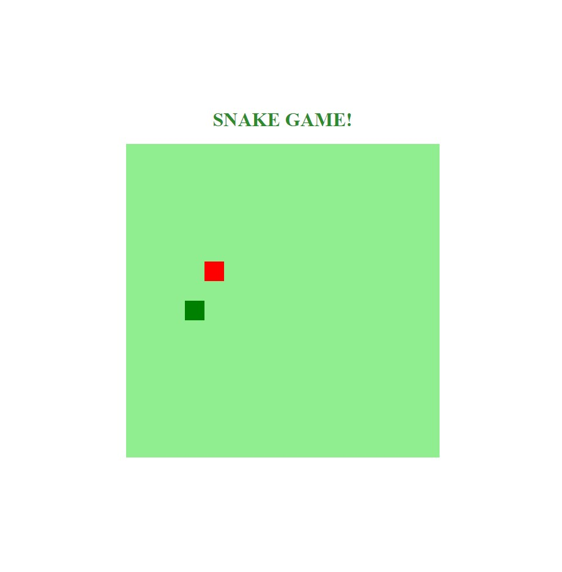

<h1 align="center">
    
</h1>

  :white_check_mark: <a href="https://andreadcsousa.github.io/dio_desafio_snake/" target="_blank">Veja a página</a>&nbsp;&nbsp;&nbsp;|&nbsp;&nbsp;&nbsp;
  :white_check_mark: <a href="https://web.digitalinnovation.one/home" target="_blank">Conheça a DIO</a>

# :computer: Projeto
 
- Idealizador: Digital InnovationOne
- Projeto: HTML Web Developer
- Lado da força: Front-End
- Tipo: Minigame interativo
- Etapa: Desenhando objetos

# :rocket: Tecnologias

Esse projeto foi desenvolvido com:

# :art: Layout

